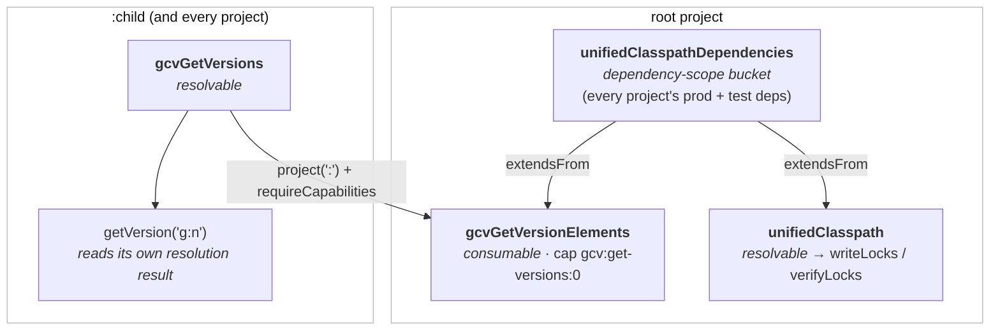

# 1. `getVersion` resolves a per-project view of the unified classpath

## Context

`getVersion('group:name')` (from `GetVersionPlugin`) lets build scripts look up the
version GCV settled on for a dependency. The no-configuration overloads originally
worked by resolving the **root** project's `unifiedClasspath` configuration to read the
version back out, regardless of which project `getVersion` was called from.

On Gradle 9 this fails when `getVersion` is called from a subproject:

```
Caused by: org.gradle.api.internal.artifacts.configurations.DefaultConfiguration$IllegalResolutionException:
Resolution of the configuration ':unifiedClasspath' was attempted without an exclusive lock. This is unsafe and not allowed.
        at com.palantir.gradle.versions.GetVersionPlugin.getOptionalVersion(GetVersionPlugin.java:98)
        at com.palantir.gradle.versions.GetVersionPlugin.getVersion(GetVersionPlugin.java:83)
```

This was a warning on Gradle 8 and is now an error: a subproject may not resolve the
root project's configuration. It commonly surfaces via `sls-packaging`'s
`minimumVersion` usage inside `subprojects { ... }`, but affects any subproject
`getVersion` call.

### Approaches considered

- **Read the `versions.lock` file directly.** All the information is there, but reading
  the lockfile from a subproject feels against the intent of GCV.
- **Read the `gcvLocks` constraints instead of resolving.** The "without an exclusive
  lock" error only applies to *resolution* — reading a configuration's declared
  `DependencyConstraint`s is fine, so the no-config lookup could read the strict
  constraints off the root `gcvLocks` platform instead. This works for the common case
  but still reads the root project's model from a subproject, it needs special-casing for the
  `getVersion(project(...))` case.
- **Per-project view of the unified graph (chosen).** Each project resolves its *own*
  configuration instead of reaching into the root's `unifiedClasspath`. This is the
  isolated-projects-shaped route and is the only one that keeps all `getVersion`
  overloads working without special-casing.

## Decision

Each project resolves a per-project view of the unified dependency graph instead of
reaching into the root's `unifiedClasspath`.

The trick is a **dependency-scope bucket** that both the resolvable (lock-computing) and
consumable (per-project) views extend, so no configuration extends one of a different
role (Gradle 9 warns on a consumable extending a resolvable, and vice versa).

- **`VersionsLockPlugin`** (root): collects every project's production + test deps into a
  new dependency-scope bucket, `unifiedClasspathDependencies`. `unifiedClasspath`
  (resolvable) now just `extendsFrom` the bucket and still computes the lock state —
  behaviour is unchanged, the bucket is purely an intermediate.
- **`GetVersionPlugin`** (root): adds `gcvGetVersionElements`, a *consumable* view that
  also extends the bucket, carrying capability `gcv:get-versions:0` and the `GCV_SOURCE`
  usage. Applies `GetVersionProjectPlugin` to every project.
- **`GetVersionProjectPlugin`** (new, per-project): registers a resolvable
  `gcvGetVersions` that depends on `project(':')` requesting that capability, and wires
  the `getVersion(...)` extension to resolve that configuration.



## Consequences

Because `getVersion` resolves the unified graph in the *calling* project, the result
still carries both locked external versions and in-build project versions, and it never
resolves a cross-project configuration — so the exclusive-lock error is gone and the
`getVersion('group:name', configuration)` / `getVersion(project(...))` cases keep working
with no special-casing.
