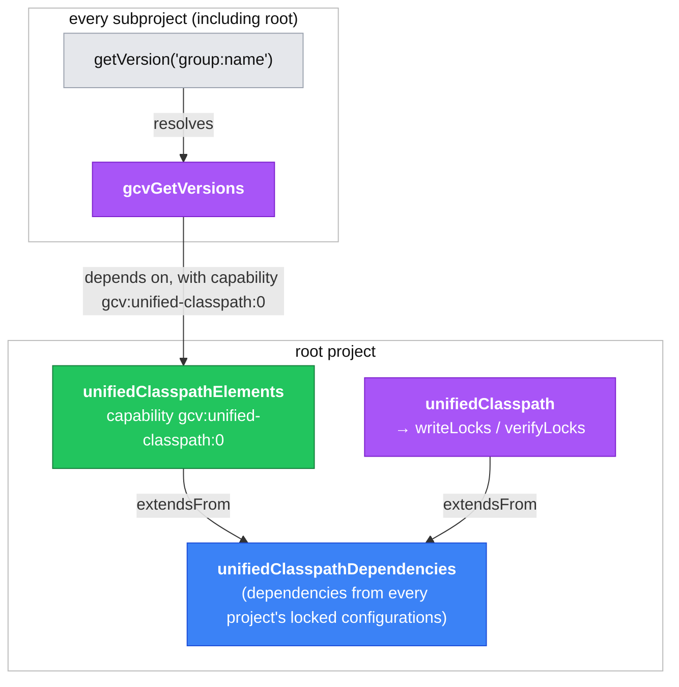

# 1. `getVersion` resolves a per-project view of the unified classpath

## Context

`getVersion('group:name')` (from `GetVersionPlugin`) lets build scripts look up the version GCV settled on for a dependency. Originally, this worked by resolving the **root** project's `unifiedClasspath` configuration to read the version back out, regardless of which project `getVersion` was called from.

On Gradle 9 this fails when it is called from a subproject:

```
Caused by: org.gradle.api.internal.artifacts.configurations.DefaultConfiguration$IllegalResolutionException:
Resolution of the configuration ':unifiedClasspath' was attempted without an exclusive lock. This is unsafe and not allowed.
        at com.palantir.gradle.versions.GetVersionPlugin.getOptionalVersion(GetVersionPlugin.java:98)
        at com.palantir.gradle.versions.GetVersionPlugin.getVersion(GetVersionPlugin.java:83)
```

This affects any subproject `getVersion` call but commonly surfaces via `sls-packaging`'s `minimumVersion` usage:
```groovy
distribution {
    productDependency {
        productGroup = "com.palantir.group"
        productName = "my-service"
        minimumVersion = getVersion('com.palantir.group', 'my-service-module-api')
        maximumVersion = "1.x.x"
    }
}
```

### Approaches considered

- **Read the `versions.lock` file directly.** The `getVersion('group:name')` lookup could parse the resolved version straight out of `versions.lock`. But `GetVersionPlugin` is as part of GCV itself, it has direct access to the very same resolved dependency model GCV uses to *write* `versions.lock`, so re-parsing its own serialised output would be backwards. It also wouldn't work: the lockfile only records *external* modules, so it couldn't serve a `getVersion` lookup that resolves to another project in the same build.
- **Read the `gcvLocks` constraints instead of resolving.** The above error only applies to *resolution* — reading a configuration's declared `DependencyConstraint`s is fine, so the lookup could read the strict constraints off the root `gcvLocks` platform instead. This works for the common case but still reads the root project's model from a subproject, it needs special-casing for the `getVersion(project(...))` case.
- **Per-project view of the unified graph (chosen).** Each project resolves its *own* configuration instead of reaching into the root's `unifiedClasspath`. This is the isolated-projects-shaped route and is the only one that keeps all `getVersion` overloads working without special-casing.

## Decision

Each project resolves a per-project view of the unified dependency graph instead of reaching into the root's `unifiedClasspath`.

This follows Gradle's intended separation of configuration roles. On the root project, a **dependency-scope configuration** holds the declared dependencies, and both the resolvable view that computes the locks and the consumable view that exposes them extend it. Each project then gets its own resolvable configuration that *consumes* that root view through a project dependency requesting its capability.

- **`VersionsLockPlugin`** (root): collects every project's production + test dependencies into a new dependency-scope configuration, `unifiedClasspathDependencies`. Two views extend it: `unifiedClasspath` (resolvable) still computes the lock state — behaviour is unchanged — and a new `unifiedClasspathElements` (consumable) exposes the same graph to other projects under capability `gcv:unified-classpath:0`.
- **`GetVersionPlugin`** (applied to every project): registers a resolvable `gcvGetVersions` configuration that depends on `project(':')` requesting capability `gcv:unified-classpath:0`, and wires `getVersion(...)` to resolve that configuration.



Box colours by configuration role: 🟦 **blue** = dependency-scope, 🟪 **purple** = resolvable, 🟩 **green** = consumable, ⬜ **grey** = plain function.

## Consequences

`getVersion` now resolves the calling project's own `gcvGetVersions` configuration. Via the capability-selected consumable view, that configuration sees exactly the same set of dependencies collected into `unifiedClasspathDependencies`, so the version returned is identical to before. The only difference is that the resolution happens in the calling project rather than reaching into another project's configuration, so the exclusive-lock error is gone.

An additional guard keeps the error from recurring through the explicit-configuration overload, `getVersion('group:name', configuration)`: since a caller can pass any configuration, `getVersion` now checks it belongs to the calling project and fails fast with a clear error otherwise.
